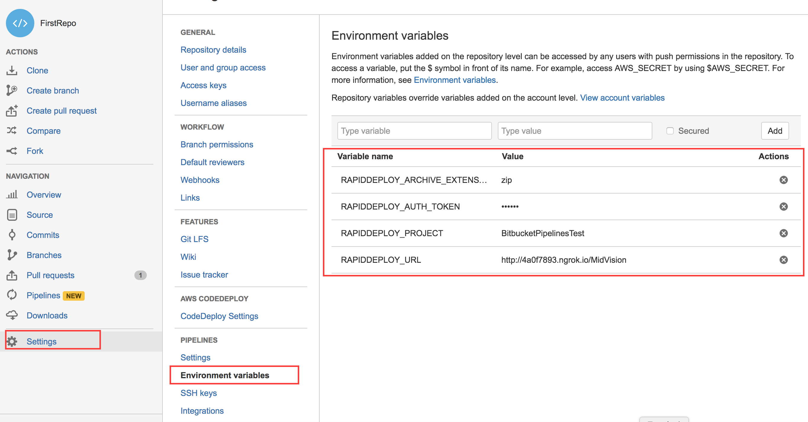

# RapidDeploy integration for Bitbucket Pipelines

### Bitbucket Pipelines

Bitbucket Pipelines is a new continuous delivery feature built within Bitbucket Cloud. RapidDeploy integration with Bitbucket is very simple. It allows you to build package, deploy or run RapidDeploy job directly from Bitbucket. You can configure your Bitbucket Pipeline to perform actions from RapidDeploy automatically every time your code is pushed to the branch.

There are three actions that you can use in your Bitbucket Pipeline
* [RapidDeploy build package task](http://docs.midvision.com/LATEST/project/package.html) invoke RapidDeploy server to build a package in the configured artifact repository. You can check the result and the log output in the Pipelines logs in Bitbucket.
* [RapidDeploy project deploy task](http://docs.midvision.com/LATEST/project/deployment.html) invoke a deployment task in RapidDeploy server. Multiple deployments can be executed sequentially or parallel. You can check the result and the process logs in the Pipelines logs in Bitbucket.
* [RapidDeploy run job plan task](http://portal.midvision.com/page/job-plan-how-to) invoke a job plan from RapidDeploy server. You can check the result and the process logs in the Pipelines logs in Bitbucket.

### Building RapidDeploy package from Bitbucket Pipelines

In order to build RapidDeploy package you need to specify following Bitbucket Environment Variables:
* RapidDeploy server url: provide the server path to your RapidDeploy with the starting http included (e.g.:http://192.168.1.1:8090/MidVision).
* RapidDeploy authentication token: provide your authentication token, which can be generated by the encryptor tool. The tool is placed under the server home directory (MV_HOME for RapidDeploy) in tools: run-web-service-encrypter.
* RapidDeploy project: RapidDeploy project name, which you want to build a package for.
* Package name (optional): set a specific package name. If not filled, the next version will be assigned to the package automatically. This field doesn’t have to be used in general.
* Archive extension: choose the package type from a list of extensions.

RAPIDDEPLOY_APPLICATION=testSubConditionals
RAPIDDEPLOY_ENVIRONMENT=testSubConditionals
RAPIDDEPLOY_JOB_PLAN_ID=27
RAPIDDEPLOY_PACKAGE_NAME=testSubConditionals-0.0.8
RAPIDDEPLOY_SERVER=server
